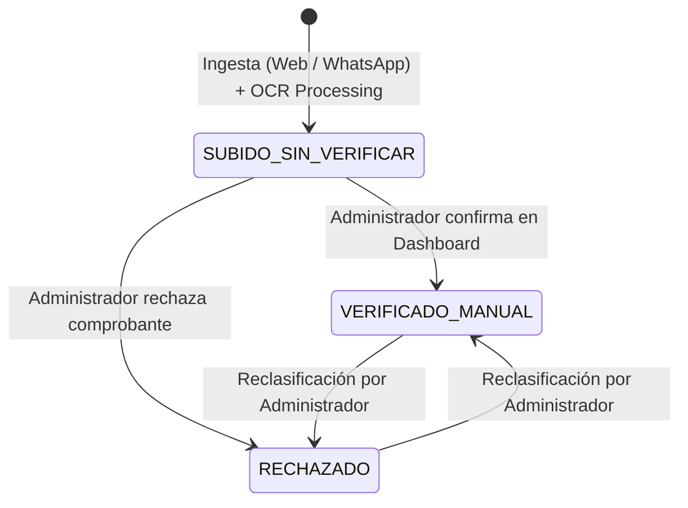

# Data Model: Automatización de Conciliación de Comprobantes (Payo - Módulo 1)

## Relational Database Schema (PostgreSQL)

### 1. Entity: `Comercios` (Tenants)
Representa a cada empresa o comercio suscrito al SaaS Payo.

| Campo | Tipo | Restricciones | Descripción |
|-------|------|---------------|-------------|
| `id_comercio` | UUID | PRIMARY KEY, DEFAULT gen_random_uuid() | Identificador único del comercio (Tenant ID) |
| `nombre_comercio` | VARCHAR(150) | NOT NULL | Nombre comercial del negocio |
| `nit_identificacion` | VARCHAR(50) | UNIQUE, NOT NULL | Número de identificación tributaria o C.C. |
| `telefono_whatsapp` | VARCHAR(20) | UNIQUE, NULLABLE | Número de teléfono formateado (+57...) para validación de origen en webhook |
| `estado_activo` | BOOLEAN | NOT NULL, DEFAULT true | Indica si el comercio está activo en la plataforma |
| `fecha_registro` | TIMESTAMPTZ | NOT NULL, DEFAULT NOW() | Fecha de alta del comercio |
| `fecha_actualizacion`| TIMESTAMPTZ | NOT NULL, DEFAULT NOW() | Última modificación |

---

### 2. Entity: `Usuarios` (Users)
Representa a los cajeros y administradores asociados a un comercio.

| Campo | Tipo | Restricciones | Descripción |
|-------|------|---------------|-------------|
| `id_usuario` | UUID | PRIMARY KEY, DEFAULT gen_random_uuid() | Identificador único del usuario |
| `id_comercio` | UUID | NOT NULL, REFERENCES Comercios(id_comercio) | Vínculo multi-tenant |
| `email` | VARCHAR(150) | UNIQUE, NOT NULL | Correo electrónico de acceso |
| `nombre_completo` | VARCHAR(150) | NOT NULL | Nombre del usuario |
| `rol` | VARCHAR(20) | NOT NULL, CHECK (rol IN ('CAJERO', 'ADMINISTRADOR')) | Rol del usuario dentro del comercio |
| `password_hash` | VARCHAR(255) | NOT NULL | Hash seguro de la contraseña |
| `fecha_registro` | TIMESTAMPTZ | NOT NULL, DEFAULT NOW() | Fecha de registro |

---

### 3. Entity: `Transacciones` (Payment Receipts)
Representa los comprobantes de pago procesados y su estado de conciliación.

| Campo | Tipo | Restricciones | Descripción |
|-------|------|---------------|-------------|
| `id_transaccion` | UUID | PRIMARY KEY, DEFAULT gen_random_uuid() | Identificador único del comprobante |
| `id_comercio` | UUID | NOT NULL, REFERENCES Comercios(id_comercio) | Vínculo multi-tenant estricto |
| `id_usuario_creador`| UUID | NULLABLE, REFERENCES Usuarios(id_usuario) | Usuario que registró el comprobante (null si fue via WhatsApp bot) |
| `banco` | VARCHAR(20) | NOT NULL, CHECK (banco IN ('NEQUI', 'BANCOLOMBIA', 'OTROS_BANCOS')) | Banco emisor detectado |
| `monto` | DECIMAL(12, 2)| NULLABLE | Monto extraído del comprobante |
| `referencia` | VARCHAR(100) | NULLABLE | Número de comprobante o referencia bancaria |
| `fecha_transaccion` | TIMESTAMPTZ | NULLABLE | Fecha/Hora extraída del comprobante |
| `url_imagen_gcs` | TEXT | NOT NULL | URI del archivo de imagen en Google Cloud Storage |
| `canal_ingreso` | VARCHAR(20) | NOT NULL, CHECK (canal_ingreso IN ('WEB', 'WHATSAPP')) | Canal por el cual ingresó la imagen |
| `estado` | VARCHAR(30) | NOT NULL, CHECK (estado IN ('SUBIDO_SIN_VERIFICAR', 'VERIFICADO_MANUAL', 'RECHAZADO')) | Estado actual de conciliación |
| `metadata_ocr` | JSONB | NULLABLE | JSON bruto con la respuesta de Cloud Vision y nivel de confianza |
| `notas_revision` | TEXT | NULLABLE | Observaciones ingresadas por el administrador |
| `fecha_creacion` | TIMESTAMPTZ | NOT NULL, DEFAULT NOW() | Fecha de ingreso al sistema |
| `fecha_actualizacion`| TIMESTAMPTZ | NOT NULL, DEFAULT NOW() | Fecha de última actualización |

---

## State Transitions (Estado de Transacción)

## Indexes for Performance & Multi-Tenancy

- `CREATE INDEX idx_transacciones_comercio_fecha ON Transacciones (id_comercio, fecha_creacion DESC);`
- `CREATE INDEX idx_transacciones_comercio_estado ON Transacciones (id_comercio, estado);`
- `CREATE INDEX idx_transacciones_referencia ON Transacciones (id_comercio, referencia);`
- `CREATE INDEX idx_usuarios_whatsapp ON Usuarios (telefono_whatsapp) WHERE telefono_whatsapp IS NOT NULL;`
